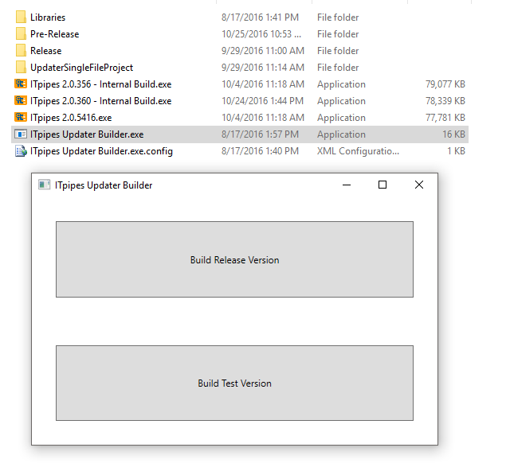

What It Does
============
This application acts as both an installer and an updater for ITpipes desktop software.

Why Not A Standard Windows Installer?
-------------------------------------
ITpipes desktop software requires that it be installed to and run from the exact path "C:\Program Files\InspectIT". It was originally designed for Windows XP, which did not have an x86 Program Files directory. Because the application is outside of the direct control of our in-house programmers, and it has hard-coded references to the path "C:\Program Files\InspectIT", it is necessary to use a custom application for installation. A standard Windows installer would automatically detect that the application is 32-bit and place it in the Program Files (x86) directory.

Additionally, updating existing ITpipes installations involves moving files out of the VirtualStore path, setting directory permissions to prevent future use of VirtualStore, writing values to ITpipes' setup.mdb configuration from the registry for Ibak integration, checking for and attempting to repair corrupt ITpipes user files, restoring user/settings/template backups, and a selection of other miscellaneous tasks. These tasks are simpler to accomplish in a custom application.

How Do I Create An Updater For New Versions?
--------------------------------------------
To build new versions, you will want to use the updater builder application. If you do not already have a copy of this tool set up, the current canonical updater builder setup as of 10/25/16 can be found on our internal server at "\\planetwincan\data\tech\it software\Updater Builder.zip".

 

* Libraries - Contains dll files the updater builder requires
* Pre-Release - This folder contains the unpacked files for the internal test version updater
* Release - This folder contains the unpacked files for the official release version updater
* UpdaterSingleFileProject - This is a C# project which acts as a self-extracting archive for bootstrapping the updater/installer.
* ITpipes Updater Builder.exe - This is the application which is used to create the single-exe installer/updater

In the updater builder application there are buttons to create a non-release updater or a release version updater. These buttons control whether the Release or Pre-Release folder will be packaged as an updater.

To create an updater for a new version, simply add the files for the new version from Robert Soltysik to the appropriate directory in the Release or Pre-Release folders, then open the updater builder application and select which version you wish to build. A single file executable will be produced. Updater file names will automatically be generated according to the version of the ITpipes.exe file in the updater's FILE directory, so once the updater/installer file is generated it is ready to use or upload to cloud storage for distribution.

What Other Custom Applications Are Included In The Updater Solution?
--------------------------------------------------------------------

The updater solution contains three applications:

* ITpipes Installation Manager

This is the installer/updater logic. Any modifications to installer logic, end user license agreement, or updater user interface will be made in this project.

* ITpipes Uninstaller

This is a custom application designed to remove ITpipes files, safely move and re-register non-ITpipes libraries, and clean ITpipes registry keys. A special uninstaller application is necessary because we do not use a standard windows MSI installer.

* InspectIT

Because our internal developers don't have access to the main application's source code, the InspectIT.exe application was created as a gateway to allow us to perform our own checks and notifications. It checks if ITpipes is already running and if ITpipes is licensed or not. If ITpipes is not licensed, the user is notified and the license request file creation tool "CheckIT" is opened instead of ITpipes. It has no other functions at time of writing.

How Do I Update The Change Log In The Installer/Updater?
--------------------------------------------------------
The change log is an embedded rtf file: Resources/changes.rtf . If any changes need to be made to the change log, make them in this file (the WPF rich text box control can't parse complex rtf logic, so it's best to edit it in Wordpad instead of Word) then rebuild the updater. That's it.

How Do I Update The EULA In The Installer?
------------------------------------------
This is handled identically to the change log. The EULA can be modified by editing Resources/EULA.rtf, saving your changes, and rebuilding the updater/installer project.

What Is The RegManifest File?
-----------------------------
The file Resources/RegManifest contains lists describing which files should be registered as COM, which should be registered as .Net Assemblies, and which should not be registered.

If a file is not mentioned in this manifest, the updater will attempt to register it as a COM library. If the return code is not 0 from regsvr32, the updater will attempt to register the file as a .Net assembly with the codebase flag to create a tlb file (allowing vb6 code to bind to exposed COM functions, if present). If that fails the file is registered as a .Net assembly without the codebase flag. Failing all of the above, the failure to register the file is logged, but the installation/update process continues.

Typically you will not need to add new files to this list manually. You will only need to add files which should not be registered to the Do Not Register section of the RegManifest document. Files which should not be registered are rare, but do occasionally come up.

Error Logging
-------------
All messages, including exceptions and warnings, are written to a log file in the updater's "Logs" directory, which can be checked for full details on any issues encountered.

New Installation Process
------------------------

* EULA is displayed and must be accepted to proceed with installation.
* The EULA text, time, and name of acceptor are written to the registry.
* If ITpipes was previously installed on this system, the user will be asked if they wish to restore the most recent configuration backup (if yes, this is processed during the "update" process).
* All redistributable packages are installed
* Default ITpipes user files are copied to the installation path (C:\Program Files\InspectIT\users)
* Uninstallation information is added to the registry
* If a backup is being restored during this session, it is restored (see "Restoring Backups" section for details)
* The full update process is followed (see update section for details)
* Default ITpipes settings are created (see "Default Settings" section for details)
* Shortcuts are created to ITpipes in the All Users desktop and Start menu shortcuts are created for ITpipes, ManageIT, and Template Editor

Update Process
--------------

* If a backup was not restored, a new backup is created
* Any files in Virtual Store are composited into the ITpipes folder (see Virtual Store section for details)
* Libraries are copied to the install path and registered
* The Montivision DirectShow filter (demosource.ax) has its registry values modified to point to the ITpipes logo instead of the Montivision logo.
* A collection of specific ActiveX controls are unregistered and re-registered (for an unknown reason these specific files must be unregistered on some systems before they will register correctly).
* Overlay control drivers are copied and registered
* All registry keys contained in the updater's RegKeys folder are registered
* All files contained in the updater's BlankDb folder are copied to the ITpipes install path
* All executables and loose files in the updater's FILE directory are copied to the root of the ITpipes install path.
* All Template files in the updater's Templates directory are copied to the "Stock Templates" folder in the ITpipes templates directory
* If Overwrite Templates option was selected by user, all templates in the updater's Templates directory are copied to the ITpipes templates directory, overwriting existing templates.
* If setup.mdb file existed in ITpipes directory already, all settings are copied to the new setup.mdb included in the updater's BlankDb folder (see "Settings Update" section for details)
* ViewIT is updated with the version in the updater's ViewIT folder, overwriting all files.
* A "_Temp" subdirectory is created in the ITpipes install directory. Several clients have had permissions issues which prevented their system from creating this directory and generating reports in ITpipes until this directory exists. This was added to the updater to prevent future clients from encountering this issue and calling tech support.
* The updater attempts to recover any corrupt user files (see "Corrupt User Files" section for details)
* To prevent program errors and the use of VirtualStore, the updater sets directory access permissions on the ITpipes installation directory, the default projects directory ("C:\IT Projects") and all items contained in those directories to allow standard users read/write access.

Corrupt User Files
------------------
Occasionally user files will become corrupt if ITpipes exits while writing changes to the user file. When a user successfully logs in, a copy of that user file is created with the extension .bak just in case the user is corrupted.

ITpipes itself does not restore these backups (though a feature request has been submitted for quite some time)--if a user file is corrupt ITpipes shows a series of error messages ("The central directory was not found in the archive" -> "Zip not open!" -> "Cannot find project db") and the user is not available in the software.

This frequently resulted in tech support calls, and leaving instructions on manually replacing the corrupt .usr file with its .bak file was frequently confusing to clients and caused additional tech support issues when done incorrectly. To ameliorate the tech calls, the updater had functionality added to automatically restore any corrupt user files it detects.

Virtual Store
-------------
VirtualStore is a directory in the user folder ("\users\{username}\appdata\local\VirtualStore") which was added with UAC in Windows Vista. Basically, many applications stored configuration and data in protected system folders, such as Program Files. With the introduction of UAC, standard user accounts no longer had write access to the Program Files directory. To prevent applications from breaking, Windows introduced VirtualStore as a user-writable way to write to Program Files directories.

If a program launched with a user account attempts to write to a protected directory, Windows silently writes to the VirtualStore directory instead. If any files exist in VirtualStore, when an application requests those files from the Program Files directory, Windows returns the version from VirtualStore instead.

This causes havoc when trying to update license files or templates, as the version in Program Files\InspectIT is not the version that ITpipes sees. Previously this caused frequent calls to the tech department.

To resolve this, the installer/updater checks the VirtualStore directory for any files newer than the version in the Program Files\InspectIT path, and if newer files are found they are moved to Program Files\InspectIT. Once the Program Files path contains the newest versions of all files, the VirtualStore directory containing ITpipes files is hidden so that it will no longer be silently provided by Windows, and at the end of the install/update process the updater sets permissions on all ITpipes directories to allow standard users write access--this prevents future use of VirtualStore.

Default Settings
----------------
The setup.mdb file in the BlankDB directory provided by Robert Soltysik (developer of ITpipes desktop) does not contain a row on the [S] table with default settings values, so the updater will create a row with the default settings preferred to minimize tech support.

These options are:

* Counter V1 disabled and set to "US Digital"
* Counter V2 disabled
* Video WriteData disabled (can cause additional slowness/crashing in some versions if enabled)
* Backup Files enabled
* Disable Video Feed Cloning (this is not in setup.mdb--it is controlled by adding a file named "turnoverlay.off" to the install directory)

Settings Update
---------------
When the updater is run it transfers existing settings into a blank copy of the latest version of the setup.mdb file. This allows settings to be added in new versions without disrupting existing settings.

When updating settings the following process is followed:

* The existing setup.mdb file in "C:\Program Files\InspectIT" is renamed to "setup.mdb.bak"
* The latest setup.mdb file is copied from the updater's BlankDb folder to "C:\Program Files\InspectIT\setup.mdb"
* All columns which exist in the [S] table of the old and new versions of setup.mdb are transferred to the [S] table in the new setup.mdb
* If Mpeg2 or Mpeg4 settings (not available by default) have been added to the old setup.mdb, they are also added to the new setup.mdb
* If video input configuration exists in the S_Video table of the old setup.mdb, transfer the same values to the new setup.mdb
* Update all video recording profiles (R_Video_Profiles table) in the new setup.mdb to match the values in the old setup.mdb
* Copy all projects from the old setup.mdb's [P] table to the new setup.mdb's [P] table
